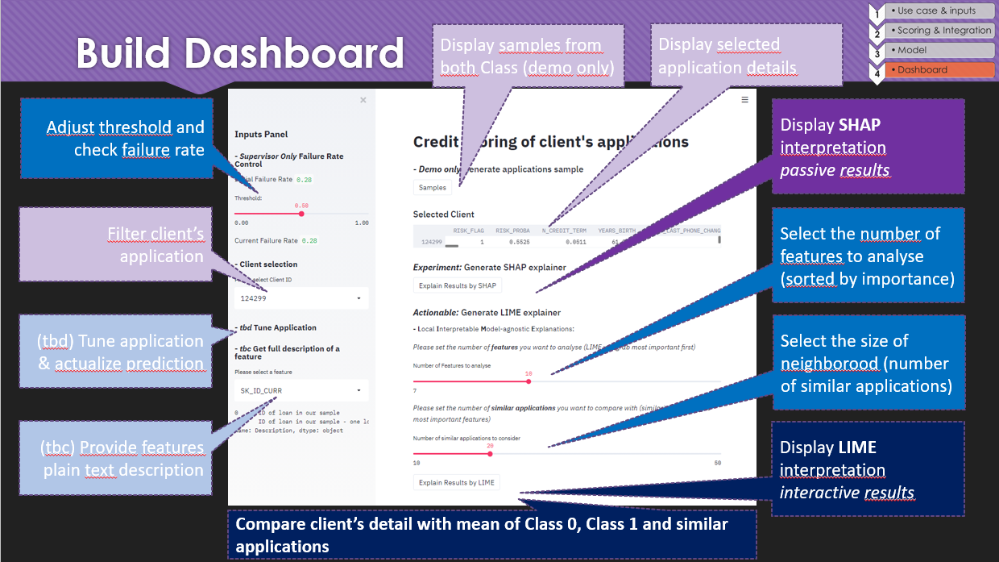

# Streamlit_App

Student's project - openclassrooms Credit Scoring of Client's application

either you run app hosted by streamlit : 
https://share.streamlit.io/etiennelardeur/streamlit_app/main/local_app.py

or download & run local :
streamlit run local_app.py
even if the app appears at localhost, but any inputs are from the Github repo.

